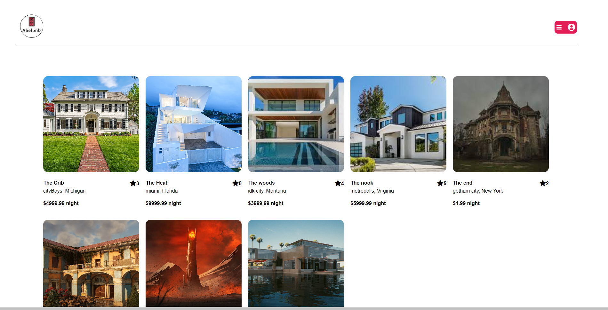
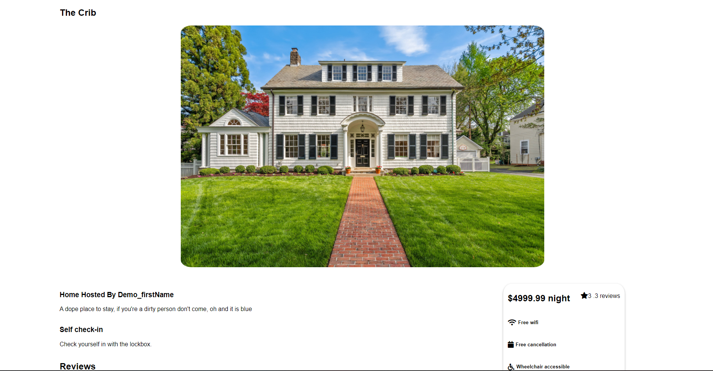
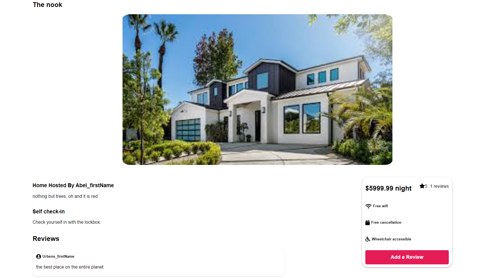

# About AbelBnB

### AbelBnB is a web application inspired by Airbnb, that allows a user to list a rental property, delete a rental property, and review other rental properties -[click here to view AbelBnB](https://abelbnb.herokuapp.com/)

### Links to Project wiki

- [Database Schema](https://github.com/abrianvil/API-project/wiki/Database-Schema)
- [Api Routes](https://github.com/abrianvil/API-project/wiki/Api-Routes)
- [Redux Store State Shape](https://github.com/abrianvil/API-project/wiki/Redux-store-state-shape)
- [Feature List](https://github.com/abrianvil/API-project/wiki/FeatureList)

### This Project is Built with

